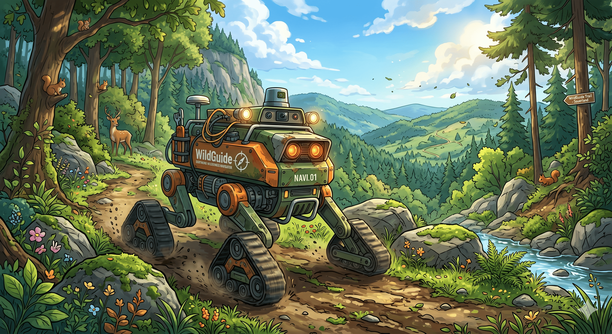

# wild-guide
Autonomous Navigation System for outdoor 

### FreeCAD Design

This repo is developed for Outdoor Navigation.

|ROS2 Packages|Description|Docs|
|---|---|---|
|wildguide_localization|ROS2 package for localization using GPS and IMU data.|[Documentation](wildguide_localization/README.md)|
|wildguide_navigation|ROS2 package for navigation and path planning.|[Documentation](wildguide_navigation/README.md)|
|wildguide_control|ROS2 package for controlling the robot's movement based on navigation commands.|[Documentation](wildguide_control/README.md)|
|wildguide_perception|ROS2 package for processing sensor data and obstacle detection.|[Documentation](wildguide_perception/README.md)|
|wildguide_interface|ROS2 package for user interface and interaction with the system.|[Documentation](wildguide_interface/README.md)|
|wildguide_description|ROS2 package for robot description and visualization.|[Documentation](wildguide_description/README.md)|
|wildguide_simulation|ROS2 package for simulating the robot in a virtual environment.|[Documentation](wildguide_simulation/README.md)|
