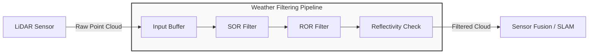

# Weather Core

## Weather PC Filter

In outdoor navigation, LiDAR sensors often encounter performance degradation due to adverse weather conditions such as fog, rain, or snow. These conditions introduce noise and "phantom" obstacles into the data. To mitigate this, the Weather Filter module is implemented to preprocess the point cloud, utilizing statistical and radial analysis to remove outliers before the data reaches the fusion layer.

Core Components
The filter employs a multi-stage approach to ensure data integrity:

- Statistical Outlier Removal (SOR): Computes the mean distance of each point to its neighbors. Points that deviate significantly from the global average distance are identified as noise (e.g., fine mist or fog) and removed.

- Radius Outlier Removal (ROR): Specifically targets sparse outliers by checking the number of neighbors within a fixed radius. If a point has too few neighbors, it is discarded—highly effective for erratic rain droplets.

- Environmental Masking: Allows for additional heuristic-based filtering depending on the intensity of the return signal, which often varies in heavy precipitation.

